  

  

  
  

  
  

  <picture>
    <source media="(prefers-color-scheme: dark)" srcset="https://raw.githubusercontent.com/kruon7/kruon7/gh-pages/github-snake-dark.svg" />
    <source media="(prefers-color-scheme: light)" srcset="https://raw.githubusercontent.com/kruon7/kruon7/gh-pages/github-snake-light.svg" />
    
  </picture>

  

  <i>Сделано с 💜</i>

